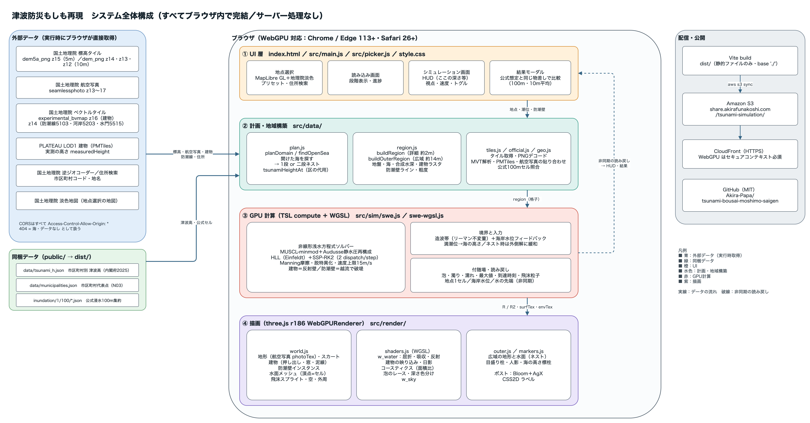
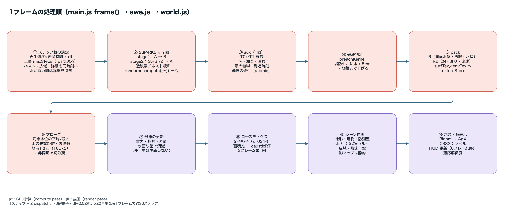
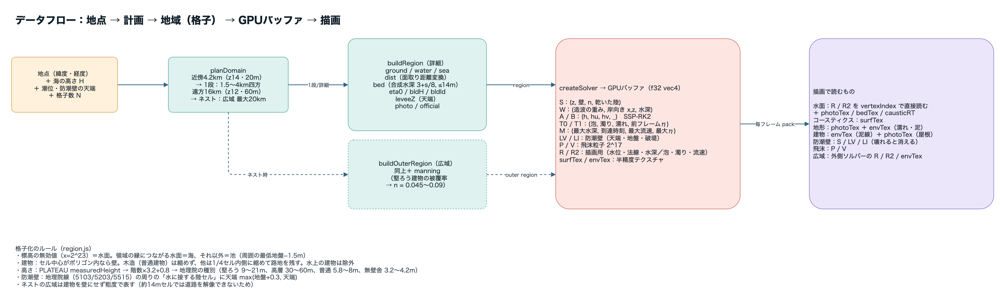
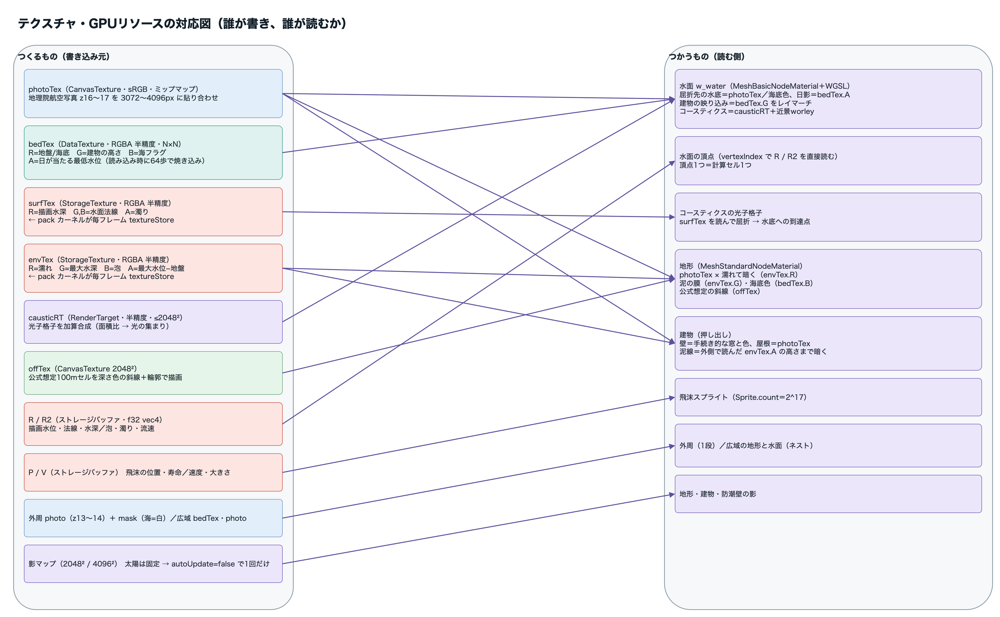
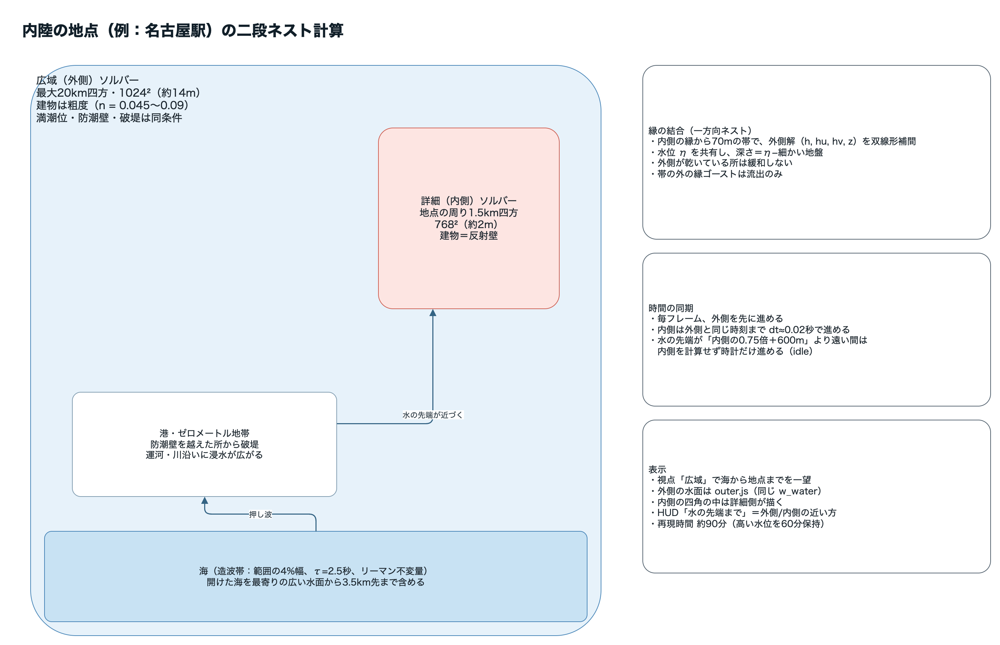

# アーキテクチャ（リバースエンジニアリング資料）

ソースコードを読み解いて、構成・物理・描画・運用をまとめた資料です。本文には、根拠となる `ファイル:行` を付けています。コメントと実装が違う箇所は、各章の中で指摘しています。

| 章 | 内容 |
|---|---|
| [01 全体構成](01_全体構成.md) | 構成図、データの流れ、1フレームの処理、ネスト計算、テクスチャの要点 |
| [02 データ取得と格子化](02_データ取得と格子化.md) | 地点の計画（`planDomain`）、地理院・PLATEAU・同梱データの取得、格子化、防潮壁、潮位 |
| [03 物理ソルバー](03_物理ソルバー.md) | 支配方程式と離散化、GPU バッファ、カーネル、境界条件、造波と水位フィードバック、破堤、テスト T1〜T3 |
| [04 描画とテクスチャ](04_描画とテクスチャ.md) | テクスチャとバッファの全一覧、各メッシュ、水面シェーダー `w_water`、コースティクス、描画順、性能上の工夫 |
| [05 アプリの流れとUI](05_アプリの流れとUI.md) | 画面遷移、起動シーケンス、`createApp`、URL パラメータ、用語の実装箇所、レスポンシブ対応 |
| [06 ビルド・公開・検証](06_ビルド公開と検証.md) | Vite の設定、`dist/` の構成、S3 公開の手順、検証の方法、これまでの不具合 |

## 図（draw.io）

| 図 | 元ファイル |
|---|---|
|  | [01_システム全体構成.drawio](図/01_システム全体構成.drawio) |
|  | [02_1フレームの処理.drawio](図/02_1フレームの処理.drawio) |
|  | [03_データフロー.drawio](図/03_データフロー.drawio) |
|  | [04_テクスチャとGPUリソース.drawio](図/04_テクスチャとGPUリソース.drawio) |
|  | [05_二段ネスト計算.drawio](図/05_二段ネスト計算.drawio) |

PNG は、draw.io の CLI で2倍に拡大して書き出しています。

```bash
drawio -x -f png -s 2 -b 24 -o 図/01_システム全体構成.png 図/01_システム全体構成.drawio
```
